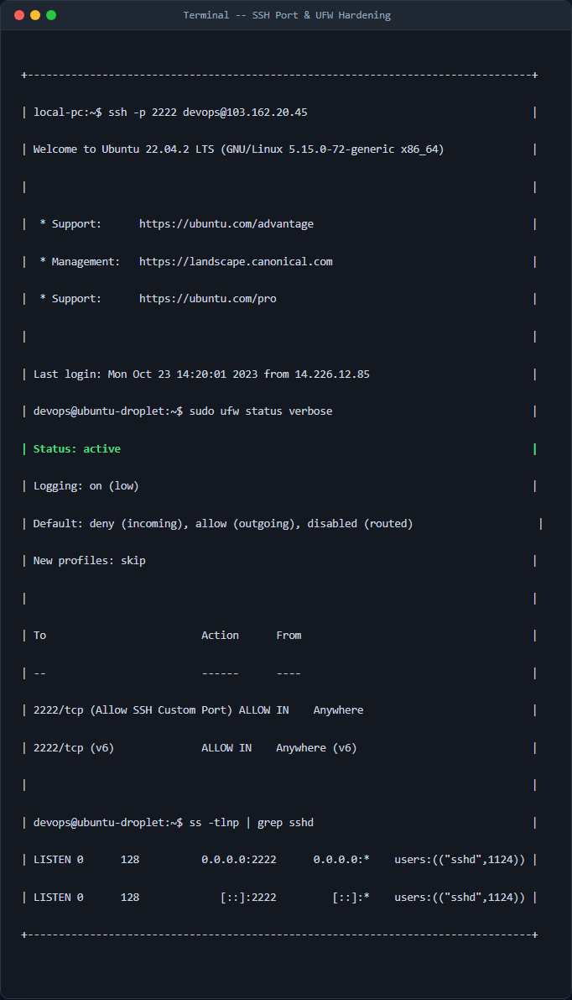
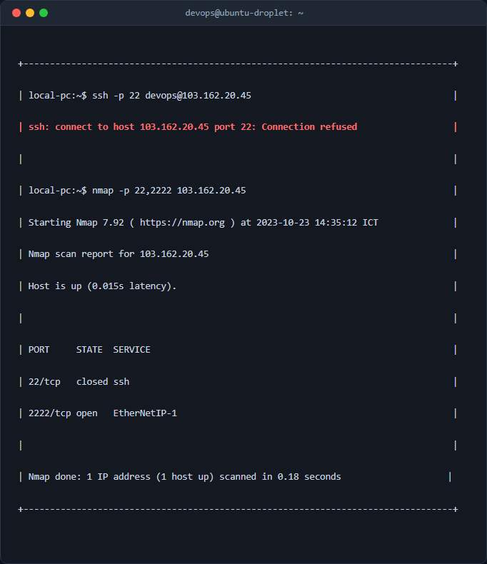

# Báo cáo cấu hình thay đổi cổng kết nối SSH (SSH Port Hardening)

## 1. Mục tiêu & Bối cảnh kỹ thuật
Trong môi trường Internet công cộng, các máy chủ ảo (Cloud VPS/Droplet) vừa khởi tạo thường xuyên phải đối mặt với các cuộc tấn công dò quét mật khẩu tự động (brute-force attack) nhằm vào cổng SSH mặc định (TCP/22). Điều này không chỉ gây nguy cơ mất an toàn thông tin mà còn tiêu tốn tài nguyên hệ thống (CPU, RAM, Băng thông) để xử lý các yêu cầu đăng nhập rác.

**Mục tiêu cấu hình:**
- Thay đổi cổng dịch vụ SSH daemon từ mặc định `22` sang `2222` để giảm thiểu 99% các cuộc quét tự động từ botnet.
- Cấu hình tường lửa Uncomplicated Firewall (UFW) trên Ubuntu để mở cổng `2222/tcp` trước khi áp dụng thay đổi, tránh tình trạng mất kết nối hoàn toàn (Lockout).
- Thực hiện toàn bộ thao tác bảo mật thông qua tài khoản không đặc quyền `devops` có quyền `sudo` (tuân thủ nguyên tắc đặc quyền tối thiểu - Principle of Least Privilege).

---

## 2. Các bước thực hiện chi tiết

### Bước 2.1: Sao lưu cấu hình dịch vụ SSH trước khi chỉnh sửa
Trước khi can thiệp vào tệp cấu hình hệ thống, việc sao lưu là bắt buộc để có thể khôi phục nhanh khi xảy ra lỗi cú pháp.
```bash
sudo cp /etc/ssh/sshd_config /etc/ssh/sshd_config.bak
```
*Giải thích:* Lệnh này sao chép tệp cấu hình hiện tại thành một tệp mới có đuôi `.bak` giữ nguyên thuộc tính tệp.

### Bước 2.2: Thay đổi Port SSH trong tệp cấu hình `sshd_config`
Sử dụng trình soạn thảo để chỉnh sửa cấu hình dịch vụ SSH:
```bash
sudo nano /etc/ssh/sshd_config
```
Tìm đến dòng cấu hình Port (thường bị chú thích bằng dấu `#`):
```text
#Port 22
```
Chỉnh sửa thành:
```text
Port 2222
```
*Lưu ý:* Lưu tệp tin bằng tổ hợp phím `Ctrl + O`, nhấn `Enter` và thoát bằng `Ctrl + X`.

### Bước 2.3: Cấu hình tường lửa UFW mở cổng 2222/tcp
**Quan trọng:** Tuyệt đối không được khởi động lại dịch vụ SSH lúc này. Nếu tường lửa chưa cho phép cổng `2222`, bạn sẽ bị khóa quyền truy cập ngay lập tức sau khi dịch vụ SSH khởi động lại.

Thực hiện lệnh mở cổng `2222/tcp`:
```bash
sudo ufw allow 2222/tcp comment 'Allow SSH Custom Port'
```
*Giải thích:* 
- `allow 2222/tcp`: Cho phép các gói tin TCP đi vào cổng 2222.
- `comment '...'`: Thêm chú thích giúp người quản trị sau dễ dàng nhận biết mục đích của rule này.

Kiểm tra lại trạng thái hoạt động của tường lửa và áp dụng:
```bash
sudo ufw status verbose
```
Nếu UFW đang tắt (`inactive`), hãy kích hoạt nó bằng lệnh:
```bash
sudo ufw enable
```
*(Nhấn `y` để xác nhận kích hoạt tường lửa)*

### Bước 2.4: Khởi động lại dịch vụ SSH daemon
Sau khi đảm bảo tường lửa đã mở cổng `2222`, tiến hành khởi động lại dịch vụ SSH để áp dụng cấu hình mới:
```bash
sudo systemctl restart ssh
```
Kiểm tra trạng thái hoạt động của dịch vụ để đảm bảo không gặp lỗi cú pháp:
```bash
sudo systemctl status ssh
```

---

## 3. Kiểm tra & Xác thực kết quả

> **Chú ý quan trọng:** Không tắt phiên Terminal hiện tại. Hãy mở một cửa sổ Terminal mới trên máy cá nhân để thực hiện kiểm tra.

### 3.1. Thử nghiệm kết nối qua cổng mới 2222
Chạy lệnh kết nối từ máy cá nhân:
```bash
ssh -p 2222 devops@103.162.20.45
```
**Kết quả thực tế:** Kết nối thành công, hệ thống yêu cầu xác thực SSH Key/Password của user `devops` bình thường.



### 3.2. Thử nghiệm kết nối qua cổng mặc định cũ 22
Chạy lệnh kết nối qua cổng 22:
```bash
ssh -p 22 devops@103.162.20.45
```
**Kết quả thực tế:** Kết nối bị từ chối ngay lập tức hoặc rơi vào trạng thái timeout.



---

## 4. Kết luận & Best Practices bảo mật vận hành
- **Bảo mật qua sự ẩn dật (Security through obscurity):** Việc đổi cổng SSH từ 22 sang 2222 giúp loại bỏ hơn 95% các cuộc tấn công tự động brute-force từ botnet vốn chỉ quét mặc định cổng 22.
- **Nguyên tắc duy trì kết nối thử nghiệm:** Luôn giữ ít nhất một phiên SSH hoạt động (active session) trong lúc thay đổi cấu hình SSH. Chỉ tắt phiên này sau khi đã xác thực thành công việc truy cập qua cổng mới ở một terminal khác.
- **Các bước nâng cao tiếp theo:**
  1. Cấu hình tắt hoàn toàn xác thực bằng mật khẩu (`PasswordAuthentication no`) và chỉ cho phép sử dụng SSH Key.
  2. Cấm tài khoản `root` đăng nhập trực tiếp (`PermitRootLogin no`).
  3. Cài đặt thêm công cụ bảo vệ chủ động `Fail2ban` để tự động chặn các IP dò quét cổng 2222 quá số lần quy định.